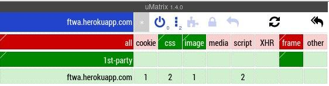

# ftwa


**File transfer web application** is a service for fast, secure and convenient file transfer in your local network or through the global web.

The speed is achieved thanks to **golang**, designed to create high-load and fast web services.

Security and confidentiality has become possible thanks to the use of the secure **https** protocol with **SSL** certificates, as well as the absence of any central instance (you are independent of it, you yourself are free to raise your service wherever you want). Also, the project does not depend on companies that do not care about your freedom, such as *Google* or *Cloudflare* (the service does not use *CDN* and similar technologies, all the code and content belongs to and can only be viewed by **you**). JavaScript is used only for loading and previewing files, as well as for changing the theme.



### Desktop


### Mobile


## Public Instances


[Main](https://ftwa.herokuapp.com) - demo showing applied UI/UX solutions

[Testing](https://secure-lake-20134.herokuapp.com) - technodemo to show how the application works


## Core features

- [x] simple and readable code

- [x] access to your files from anywhere in the world or from the local
  network

  - [ ] git synchronizaation

  - [x] encryption

  - [x] privacy and confidentiality

  - [x] convenient and nice looking interface

    - [x] file preview(now only in upload interface)

    - [x] dark theme 

    - [x] adaptive design


## Getting the source code

### via git clone

```bash

git clone https://github.com/DanteAlighierin/ftwa.git
cd ftwa

```


### via go get

```bash

go get github.com/DanteAlighierin/ftwa
cd go/src/github.com/DanteAlighierin/ftwa

```


## Installation

Satisfy dependencies and generate certificates manually:

```bash

##generate certificates
sudo chmod +x cert.sh
./cert.sh

```
or use the script:

```bash
sudo chmod +x installer.sh
./installer.sh

```


Run app interactively:

```bash

go run main.go

```

or build the binary:

```bash
go build

```

## Issues & bugs


If you know how to solve the following problems, then open a pull request:

- Unreadable filenames of uploaded files

- Loss of cerificates

- So far only Linux is supported (and possibly macOS X)
	
	Currently, work is underway to support Windows

- The binary requires a pre-configured environment

	For this reason, demos exist both to show the UI and to show the functional part separately. 
	Since heroku does not support multilingual environments by default (ftwa backend is written in golang and bash)


If you are faced with other problems, then open an issue.
